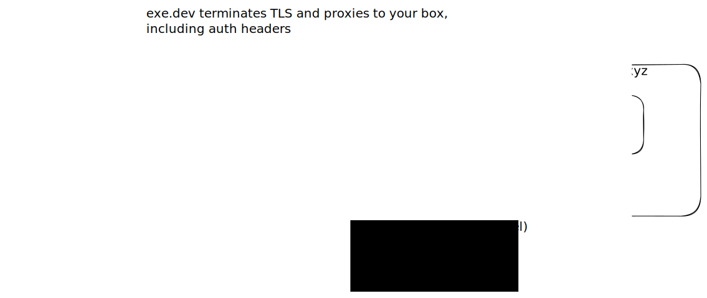

`exe.dev` proxies traffic to https://boxname.exe.dev/ to your box seamlessly, handling
certificates, TLS termination, and optionally offering basic authentication.

## Configuring which port to proxy

By default, `exe.dev` proxies port 80. This default can be influenced by
setting `Config.ExposedPorts` (via the `EXPOSE` directive in a `Dockerfile`)
to a different port, which, if it's above 1024 and tcp will be chosen.

You can change the port chosen with `ssh exe.dev share port <boxname> <port>`.
This updates the proxy target while keeping the current visibility setting
(private by default).

## Private vs Public Proxies

By default, only users with access to the box can access the HTTP proxy. Users
accessing https://boxname.exe.dev/ for the first time will be redirected to log
into `exe.dev`.

To share your site publically, run `ssh exe.dev share set-public <boxname>`.
Return it to private access with `ssh exe.dev share set-private <boxname>`.

## Using exe.dev authentication

If you would like to build out authorization in your service, you may
leverage exe.dev's existing authentication. Look for `X-ExeDev-UserID` and `X-ExeDev-Email`
headers in the requests coming into the box. These headers are only present when
the user is authenticated via exe.dev.

- `X-ExeDev-UserID`: A stable, unique user identifier
- `X-ExeDev-Email`: The user's email address

## Reverse proxy headers

Requests proxied by exe.dev include standard `X-Forwarded-*` headers so your
application can reconstruct the original public request information:

- `X-Forwarded-Proto`: `https` when the client connected over TLS, otherwise `http`
- `X-Forwarded-Host`: The full host header (including port) that the client requested
- `X-Forwarded-For`: A comma-separated list containing any prior `X-Forwarded-For` value plus the client's IP as seen by exe.dev

### Special Authentication URLs

The following special URLs are available for authentication flows:

- **Login**: `https://{your-box}.exe.dev/__exe.dev/login?redirect={path}`

- **Logout**: POST `https://{your-box}.exe.dev/__exe.dev/logout`

### Example: nginx configuration

The following `nginx` configuration allows only specified email addresses to access a protected location:

```nginx
server {
    listen 80;
    server_name _;

    location / {
        # Check if X-ExeDev-Email header matches allowed addresses
        set $allowed "false";
        if ($http_x_exedev_email = "alice@example.com") {
            set $allowed "true";
        }
        if ($http_x_exedev_email = "bob@example.com") {
            set $allowed "true";
        }

        # Return 403 if not allowed
        if ($allowed = "false") {
            return 403 "Access denied. Please log in with an authorized account.";
        }

        # Serve content for authorized users
        root /var/www/html;
        index index.html;
        try_files $uri $uri/ =404;
    }
}
```

## Additional Ports

The proxy transparently forwards ports between 2000 and 9999.

For example, if you are serving on port 3456 on your box,
you can access that at https://boxname.exe.dev:3456/.

Non-default ports cannot be made fully public.
