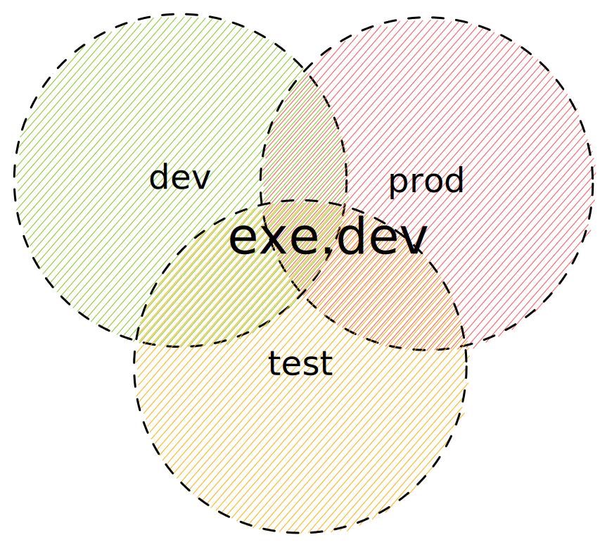
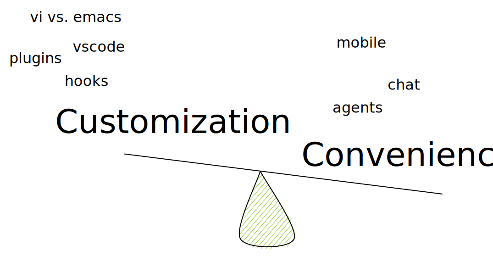

Industry-wide, we often develop our software in three distinct environments.
Perhaps your laptop is a Mac; your CI system is hosted GitHub Actions, and your
prod is k8s.

# Three-in-One

For some use cases, you need not bother with the complexity; use one exe.dev vm
for all three. A blog, a dashboard, a link shortener, a bot, and so on: these
work well with the environments collapsed. Add features by asking Shelley to do
so. Setup continuous deployment by asking Shelley to poll every hour. Use git
for a backup if it calls for it. Voila!

Our internal tools sport an "Edit with Shelley" ribbon.
[TODO: add ribbon right here as ane example]

# Just Dev

Use an exe.dev vm (or many) to work on your software. Setup the GitHub
integration ([docs](integrations-github)) to make cloning easy. Some people work
serially. Some people work using multiple worktrees on one vm. Some people have
one vm per task or project. Clone your VMs using ‘cp’ or configure them using
setup scripts.

Using remote VMs opens up the convenience of mobile, opportunities for sharing,
not to mention isolation from your other projects. 

Why now? Many, many companies have tried remote development before. There is
an entire graveyard of failed startups in this space. The big difference is
agents. If your development is increasingly chat-based, the old arguments about
getting your environment and dot-rc files just right fade away. The convenience
of starting a task from your phone overwhelms the decades-old bashrc file and
finely crafted PS1. As a bonus, you get the ability to share with your co-workers.
Pull requests are so yesterday; send them a link to the working product instead.

# Just Test

Exe.dev VMs are a great place to riff on an idea. Perhaps you want to explore a
particular open source project. Or you want to do some data analysis and share
it with your co-workers? Or prototype your next idea? Or find your flakes by
running your tests over and over again. Or let loose Shelley, our agent, on
your app with its built-in browser? Or send off a security review. Or even
just run a GitHub Actions runner.

Because you pick what access you want to give your VMs, and because they’re
[persistent](serverful), exe.dev VMs are great
places to test stuff out. 

# Just Prod

You can host real, production software in exe. We support custom domains with a bit of DNS
configuration ([docs](cnames)).

If you’re incredulous that this is a good idea, the entirety of Stack Overflow
ran on [just a few
machines](https://nickcraver.com/blog/2016/02/17/stack-overflow-the-architecture-2016-edition/).
Reach out to us, if you want to enlarge your VM as far as modern hardware can
go.

